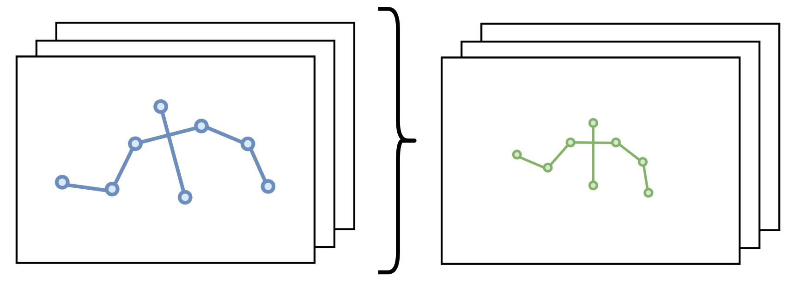

# SkelRetarget

*A Python toolbox to normalize and retarget skeletal motion sequences.*

---

`skelretarget` provides methods that:
1) take as input a sequence (or batch) of skeletal poses which may vary in scale, bone lengths 
or coordinate system, but sharing the same skeletal structure,
2) produce skeletal poses that preserve relative positions of joints within the skeletal reference 
while ensuring that all poses are expressed on a canonical/normalized skeleton within a common centered coordinate system.

> [!NOTE]  
> First intended usage of these tools is **preprocessing Sign Language skeletal pose sequences**
> to prepare datasets for the training of deep learning models.

## Installation

```commandline
git clone https://github.com/GFaure9/skelretarget.git
cd skelretarget
pip install -r requirements.txt
```

## Usage example

To use poses' bones orientations and constant bone lengths for retargeting, follow these steps:

```python
from skelretarget.utils import load_csv_skels, make_video_simple
from skelretarget import MP178SkelRetarget

skels = load_csv_skels('path/to/your/skels.csv')  # shape=(B, 178, 3) | assuming a Mediapipe-like 178 joints skeletal structure
retargeter = MP178SkelRetarget()
retargeted_skels = retargeter.run(
    method="bones_orientations",
    face_normalize_method="bounding_box", 
    face_centering_method="pelvis_face_centroid",
)
make_video_simple(
    skels, retargeted_skels, 
    bones=retargeter.skel_def["CONNECTIONS"],
    no_link_ids=retargeter.face_ids,
    out_file="path/to/your/output/video.mp4",
    fps=25,
)
```

If you rather want to find and apply similarity transformations to poses to 
best match a centered normalized torso, please use the `run(...) ` method with the following
arguments:

```python
retargeted_skels = retargeter.run(method="similarity_transform")
```

